# Database Table Relationships Documentation

## 🗂️ Entity Relationship Overview

This document provides a comprehensive view of all table relationships in the multi-tenant hospital management system.

## 📊 Current Database State (Public Schema)

### ⚠️ IMPORTANT: Limited Implementation
**Current Status**: Only `tenants` table exists. Other tables pending migration resolution.

### Planned Entity Relationships

```mermaid
erDiagram
    TENANTS ||--o{ USERS : "will have many (not implemented)"
    USERS ||--o{ USER_ROLES : "will have many (not implemented)"
    ROLES ||--o{ USER_ROLES : "will have many (not implemented)"
    USERS ||--o{ USER_VERIFICATION : "will have many (not implemented)"

    TENANTS {
        varchar_255 id PK "✅ EXISTS"
        varchar_255 name "✅ EXISTS"
        varchar_255 email "✅ EXISTS"
        varchar_255 plan "✅ EXISTS"
        varchar_255 status "✅ EXISTS"
        timestamp joindate "✅ EXISTS"
    }

    USERS {
        integer id PK "❌ NOT CREATED"
        string name "❌ NOT CREATED"
        string email UK "❌ NOT CREATED"
        string password "❌ NOT CREATED"
        string status "❌ NOT CREATED"
        string phone_number "❌ NOT CREATED"
        timestamp last_login_date "❌ NOT CREATED"
        text profile_picture_url "❌ NOT CREATED"
        integer tenant_id FK "❌ NOT CREATED"
        timestamp created_at "❌ NOT CREATED"
    }

    ROLES {
        integer id PK
        string name
        text description
        timestamp created_at
    }

    USER_ROLES {
        integer id PK
        integer user_id FK
        integer role_id FK
        timestamp created_at
    }

    USER_VERIFICATION {
        integer id PK
        string email
        string code
        string type
        timestamp expires_at
        timestamp created_at
    }
```



## 🔗 Detailed Relationship Specifications

### 1. Tenants → Users (One-to-Many)
- **Foreign Key**: `users.tenant_id` → `tenants.id`
- **Constraint**: `ON DELETE CASCADE`
- **Index**: `users_tenant_id_idx`
- **Business Rule**: Each user belongs to exactly one tenant
- **Isolation**: Users can only access data within their tenant

```sql
-- Relationship Definition
ALTER TABLE users 
ADD CONSTRAINT fk_users_tenant 
FOREIGN KEY (tenant_id) REFERENCES tenants(id) ON DELETE CASCADE;

-- Index for Performance
CREATE INDEX users_tenant_id_idx ON users(tenant_id);
```

### 2. Users ↔ Roles (Many-to-Many via User_Roles)
- **Junction Table**: `user_roles`
- **Foreign Keys**: 
  - `user_roles.user_id` → `users.id`
  - `user_roles.role_id` → `roles.id`
- **Constraints**: Both `ON DELETE CASCADE`
- **Indexes**: 
  - `user_roles_user_id_idx`
  - `user_roles_role_id_idx`
- **Business Rule**: Users can have multiple roles, roles can be assigned to multiple users

```sql
-- Junction Table Relationships
ALTER TABLE user_roles 
ADD CONSTRAINT fk_user_roles_user 
FOREIGN KEY (user_id) REFERENCES users(id) ON DELETE CASCADE;

ALTER TABLE user_roles 
ADD CONSTRAINT fk_user_roles_role 
FOREIGN KEY (role_id) REFERENCES roles(id) ON DELETE CASCADE;

-- Performance Indexes
CREATE INDEX user_roles_user_id_idx ON user_roles(user_id);
CREATE INDEX user_roles_role_id_idx ON user_roles(role_id);
```

### 3. Users → User_Verification (One-to-Many, Logical)
- **Relationship**: Logical (no foreign key constraint)
- **Link Field**: `user_verification.email` matches `users.email`
- **Business Rule**: Multiple verification codes can exist per user email
- **Cleanup**: Codes expire automatically, no cascade needed

```sql
-- Logical Relationship Query
SELECT u.*, uv.code, uv.type, uv.expires_at
FROM users u
LEFT JOIN user_verification uv ON u.email = uv.email
WHERE uv.expires_at > current_timestamp;
```

## 🏥 Tenant Schema Relationships (Example)

### Hospital Management Tables (Per Tenant Schema)


## 📋 Relationship Patterns

### 1. Cascade Delete Patterns
- **Tenant Deletion**: Deleting tenant removes all users (CASCADE)
- **User Deletion**: Deleting user removes all role assignments (CASCADE)
- **Role Deletion**: Deleting role removes all user assignments (CASCADE)
- **Patient Deletion**: Deleting patient removes appointments, records, prescriptions (CASCADE)

### 2. Soft Delete Patterns
- **User Status**: Users marked as 'inactive' instead of deleted
- **Appointment Cancellation**: Appointments marked as 'cancelled' instead of deleted
- **Record Archival**: Medical records archived instead of deleted

### 3. Audit Trail Patterns
- **Created At**: All tables have `created_at` timestamp
- **Updated At**: Some tables have `updated_at` for modification tracking
- **User Tracking**: Track which user created/modified records

## 🔍 Common Relationship Queries

### Get User with Tenant and Roles
```sql
SELECT 
    u.id, u.name, u.email, u.status,
    t.name as tenant_name, t.plan as tenant_plan,
    array_agg(r.name) as roles
FROM users u
JOIN tenants t ON u.tenant_id = t.id
LEFT JOIN user_roles ur ON u.id = ur.user_id
LEFT JOIN roles r ON ur.role_id = r.id
WHERE u.id = $1
GROUP BY u.id, u.name, u.email, u.status, t.name, t.plan;
```

### Get Tenant with User Count and Role Distribution
```sql
SELECT 
    t.id, t.name, t.status,
    COUNT(u.id) as total_users,
    COUNT(CASE WHEN u.status = 'active' THEN 1 END) as active_users,
    COUNT(CASE WHEN r.name = 'Admin' THEN 1 END) as admin_users,
    COUNT(CASE WHEN r.name = 'Doctor' THEN 1 END) as doctor_users
FROM tenants t
LEFT JOIN users u ON t.id = u.tenant_id
LEFT JOIN user_roles ur ON u.id = ur.user_id
LEFT JOIN roles r ON ur.role_id = r.id
GROUP BY t.id, t.name, t.status;
```

### Get Patient with All Related Data (Tenant Schema)
```sql
-- This query runs within tenant schema context
SELECT 
    p.id, p.name, p.email, p.phone,
    COUNT(DISTINCT a.id) as appointment_count,
    COUNT(DISTINCT mr.id) as medical_record_count,
    COUNT(DISTINCT pr.id) as prescription_count,
    MAX(a.appointment_date) as last_appointment
FROM patients p
LEFT JOIN appointments a ON p.id = a.patient_id
LEFT JOIN medical_records mr ON p.id = mr.patient_id
LEFT JOIN prescriptions pr ON p.id = pr.patient_id
WHERE p.id = $1
GROUP BY p.id, p.name, p.email, p.phone;
```

## 🚨 Referential Integrity Rules

### Global Schema Constraints
1. **Users must belong to valid tenant**: `users.tenant_id` → `tenants.id`
2. **User roles must reference valid user and role**: Junction table constraints
3. **Email uniqueness**: `users.email` must be unique across all tenants
4. **Tenant ID uniqueness**: `tenants.id` must be unique (primary key)

### Tenant Schema Constraints
1. **Patients are tenant-isolated**: No cross-tenant patient references
2. **Appointments must reference valid patient**: Within same tenant schema
3. **Medical records must reference valid patient**: Within same tenant schema
4. **Doctor references**: Validated at application level (users table)

### Cross-Schema Relationships
- **No Foreign Keys**: Cannot create FKs between different schemas
- **Application Validation**: Validate cross-schema relationships in code
- **Data Consistency**: Ensure referential integrity through application logic

## 📊 Performance Considerations

### Index Strategy
- **Primary Keys**: Automatic indexes on all primary keys
- **Foreign Keys**: Indexes on all foreign key columns
- **Composite Indexes**: For frequently queried combinations
- **Unique Indexes**: For business rule enforcement

### Query Optimization
- **Join Patterns**: Optimize for common join patterns
- **Tenant Isolation**: Queries automatically scoped to tenant schema
- **Pagination**: Use LIMIT/OFFSET with proper ordering
- **Aggregation**: Pre-calculate common aggregations where needed

## ⚠️ Common Relationship Mistakes

### Design Mistakes
1. **Cross-Tenant References**: Don't reference data across tenant schemas
2. **Missing Indexes**: Always index foreign key columns
3. **Circular References**: Avoid circular foreign key relationships
4. **Over-Normalization**: Balance normalization with query performance

### Implementation Mistakes
1. **Missing Cascade Rules**: Define proper ON DELETE behavior
2. **Inconsistent Naming**: Use consistent foreign key naming patterns
3. **No Validation**: Always validate relationships at application level
4. **Orphaned Records**: Clean up orphaned records from failed operations

### Multi-Tenant Mistakes
1. **Global References in Tenant Schemas**: Don't reference public schema from tenant schemas
2. **Tenant Context Errors**: Always validate tenant context for relationships
3. **Schema Mixing**: Don't mix tenant-specific and global data in queries
4. **Missing Tenant Validation**: Always validate user belongs to tenant

## 🔧 Relationship Maintenance

### Regular Maintenance Tasks
```sql
-- Check for orphaned user roles
SELECT ur.* FROM user_roles ur
LEFT JOIN users u ON ur.user_id = u.id
LEFT JOIN roles r ON ur.role_id = r.id
WHERE u.id IS NULL OR r.id IS NULL;

-- Check for users without tenants
SELECT u.* FROM users u
LEFT JOIN tenants t ON u.tenant_id = t.id
WHERE t.id IS NULL;

-- Check for expired verification codes
SELECT COUNT(*) FROM user_verification 
WHERE expires_at < current_timestamp;
```

### Data Integrity Checks
```sql
-- Verify all users have valid tenant references
SELECT COUNT(*) as invalid_users FROM users u
LEFT JOIN tenants t ON u.tenant_id = t.id
WHERE t.id IS NULL;

-- Verify all user_roles have valid references
SELECT COUNT(*) as invalid_assignments FROM user_roles ur
LEFT JOIN users u ON ur.user_id = u.id
LEFT JOIN roles r ON ur.role_id = r.id
WHERE u.id IS NULL OR r.id IS NULL;
```